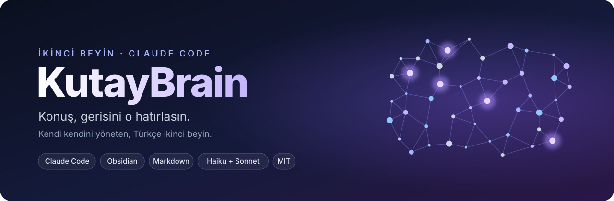
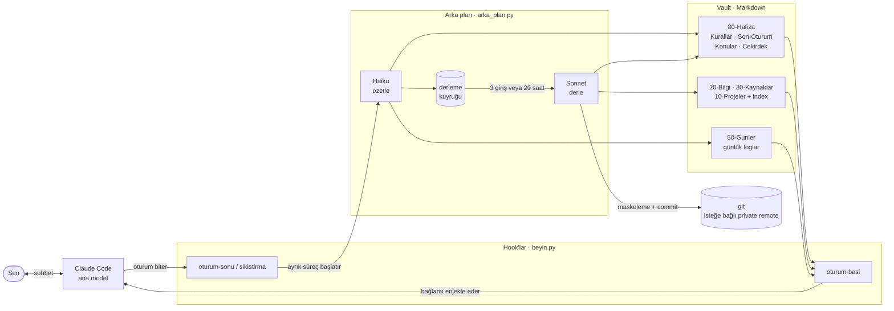

<p align="center">
  
</p>

# Mined

> *Mind, mined.* Sohbetlerin ham cevher; Mined onları kazıp kalıcı bilgiye işler.

[Claude Code](https://claude.com/claude-code) ile çalışan, Türkçe, kendi kendini yöneten bir ikinci beyin. Aynı klasör bir [Obsidian](https://obsidian.md) vault'u.

Bu klasörde `claude` yazıp sohbet edersin. **Not tutmayı, düzenlemeyi ve hatırlamayı sistem yapar**: oturum bitince konuşman özetlenir, birkaç oturumda bir kalıcı bilgi sayfalarına işlenir, sonraki oturumda Claude kaldığın yeri bilir. Her şey düz Markdown dosyasıdır; veritabanı, sunucu, ek ücret yoktur. Kendi Claude aboneliğini kullanır.

---

## Kurulum

**Gereksinimler:** [Claude Code](https://claude.com/claude-code) (giriş yapılmış), Python 3.9+, git. Obsidian isteğe bağlı (sadece notları okumak için).

1. GitHub'da **Use this template → Create a new repository** ile kendi kopyanı oluştur ve **Private** seç. Notların kişisel; public repoya yedeklenmemeli. Ya da sadece indir.
2. Klonla ve kurulumu çalıştır:

   ```sh
   git clone <senin-private-repon> ikinci-beyin
   cd ikinci-beyin
   python kurulum.py        # Windows: py -3 kurulum.py
   ```

   Kurulum adını sorar, hook komutlarını işletim sistemine göre ayarlar, git yedeğini kurar ve isteğe bağlı olarak başka proje klasörlerinde de beyni kullanmanı sağlayan global hook'ları ekler. Tekrar çalıştırmak güvenlidir.
3. `claude` yaz, konuşmaya başla. İlk oturumda kendini biraz anlat; Claude bunu `80-Hafiza/Cekirdek.md`'ye yazar.

> Kurulum yapılmadan hook'lar hiçbir şey yapmaz, not yazmaz, commit atmaz. Claude sadece kurulumu hatırlatır.

---

## Bir bakışta



Kısaca: **oturum başında** hafıza okunur, **oturum sonunda** Haiku özet yazar, **birkaç oturumda bir** Sonnet özetleri kalıcı bilgi sayfalarına işler. Vault her oturum açılışında ve her derlemede git'e commit'lenir.

---

## Kim neyi yazar

| Kim | Ne zaman | Yazdığı yerler |
| --- | --- | --- |
| **Ana model** (sohbetteki Claude) | Açıkça isteyince ("not al", "kaydet") veya davranışını düzeltince | İlgili sayfa veya `00-Gelen/`; düzeltmeler anında `Kurallar.md`'ye |
| **Haiku** (`ozetle`) | Her oturum sonunda ve bağlam sıkıştırmadan önce | `50-Gunler/YYYY-MM-DD.md`, `80-Hafiza/Son-Oturum.md` kartı |
| **Sonnet** (`derle`) | Kuyrukta 3 giriş birikince veya 20 saatte bir | `20-Bilgi/`, `30-Kaynaklar/`, `10-Projeler/`, `index.md`, `log.md`, `Konular.md`, `Cekirdek.md`, `Kurallar.md` |
| **Yedek** (`yedek`) | Her oturum açılışında, arka planda | Not yazmaz; değişiklikleri maskeler, commit'ler, (açıksa) push'lar |
| **Sen** | İstediğinde | Her yere; elle yazdığın metin hiçbir model tarafından silinmez |

Arka plan modelleri `claude -p --safe-mode` ile çalışır: kendi aboneliğini kullanırlar, CLAUDE.md, hook veya skill yüklemezler. Haiku'nun hiç aracı yoktur, sadece JSON döndürür ve dosyaları script yazar. Sonnet'in sadece `Read/Write/Edit/Glob/Grep` araçları vardır, komut çalıştıramaz.

**Alıntı doğrulaması.** Derleme iki aşamalıdır. Önce araçsız bir Sonnet günlük girişlerinden kalıcı iddiaları çıkarır ve her birine girişlerden birebir alıntı ekler. Script her alıntıyı girişlerde arar; birebir geçmeyen alıntının iddiası atılır (`.claude/durum/reddedilen.md`). İkinci Sonnet sadece doğrulanmış iddiaları görür. Bu, uydurmayı kod seviyesinde keser.

---

## Hafıza katmanları

| Katman | Soru | Dosyalar |
| --- | --- | --- |
| **Çalışan hafıza** | "Şu an neredeyiz, nasıl davranmalıyım?" | `80-Hafiza/Kurallar.md` (bağlayıcı talimatlar), `Son-Oturum.md`, `Konular.md` (çok oturumlu açık işler), `Cekirdek.md` (sen kimsin) |
| **Olay hafızası** | "Ne zaman ne konuştuk?" | `50-Gunler/` |
| **Bilgi hafızası** | "Bu konuda ne biliyoruz?" | `20-Bilgi/`, `30-Kaynaklar/`, `10-Projeler/` |
| **Katalog** | "Hangi sayfa var, ne değişti?" | `20-Bilgi/index.md`, `20-Bilgi/log.md` |

Oturum başında bağlama sadece özetler girer (en fazla 16.000 karakter). Ayrıntı gerektiğinde Claude index'ten ilgili sayfayı açar veya vault'u arar.

---

## Klasör haritası

```
├── 00-Gelen/          Ham, hızlı notlar ("şunu not al")
├── 10-Projeler/       Birden fazla oturuma yayılan projeler
├── 20-Bilgi/          Kalıcı bilgi sayfaları + index.md + log.md
├── 30-Kaynaklar/      Araçlar, kişiler, siteler, repolar
├── 50-Gunler/         Günlük oturum logları (YYYY-MM-DD.md)
├── 80-Hafiza/         Kurallar, Son-Oturum, Konular, Cekirdek
├── 90-Arsiv/          Biten veya rafa kalkan şeyler
├── Sablonlar/         Not ve günlük şablonları
├── Pano.md            Obsidian ana sayfası
├── CLAUDE.md          Ana modelin çalışma talimatları
├── kurulum.py         Tek seferlik kurulum
└── .claude/
    ├── settings.json      Hook tanımları
    ├── ayarlar.json       Adın ve yedek ayarı (kurulum yazar)
    ├── hooks/
    │   ├── beyin.py       Hızlı hook'lar: bağlam enjeksiyonu, worker başlatma
    │   ├── arka_plan.py   Ağır iş: özet, alıntı doğrulamalı derleme, maskeleme, git
    │   └── proje.py       Global hook'lar: başka projelerde hatırlatma ve oturum sigortası
    ├── skills/
    │   ├── beyin-bakim/   Sağlık kontrolü: kopya/yetim sayfa, kırık link, şişen dosya
    │   └── gecmis-aktar/  ChatGPT / Claude / Gemini geçmişini içe aktarma
    └── durum/             Çalışma durumu (git'e girmez): kuyruk, log, kilit, uyarılar
```

---

## Kullanım

| Komut / ifade | Ne yapar |
| --- | --- |
| `claude` (bu klasörde) | Hafızası yüklü oturum başlatır |
| "not al", "kaydet", "şunu unutma" | Anında ilgili sayfaya yazar |
| "böyle yapma", "daha kısa yaz" | `Kurallar.md`'ye kural olarak eklenir, hemen geçerli olur |
| "bunu kaydetme" | O konu hiçbir yere yazılmaz |
| "derle", "notları işle" | Kuyruğu hemen kalıcı sayfalara işler |
| "bakım yap", "beyni kontrol et" | `beyin-bakim` skill'i |
| "geçmişimi aktar" | ChatGPT / Claude / Gemini dışa aktarımını içe alır |

Çalışma günlüğü: `.claude/durum/arka_plan.log`. Arka planda bir şey başarısız olursa sonraki oturum başında Claude söyler.

---

## Güvenlik

**Gizli bilgi maskeleme.** "Sır yazma" kuralı sadece modellerin dikkatine bırakılmaz: transkript Haiku'ya gitmeden önce ve her commit'ten önce değişen notlar taranır; API anahtarları, token'lar, `şifre:` / `password=` kalıpları, özel anahtarlar, TR IBAN, kart numarası ve TC kimlik no `[GİZLİ: tür]` ile değiştirilir.

**Yedek.** Klasörün zaten bir git remote'u varsa kurulum otomatik push'u sorar ve varsayılan cevap *hayır*dır. Remote yoksa notlar sadece yerelde commit'lenir; sonradan kendin bir remote eklersen oraya push'lanır. Her durumda remote'un **private** olduğundan emin ol. Ayarı sonradan `.claude/ayarlar.json` içindeki `otomatik_push` ile değiştirebilirsin.

**Hata toleransı.** İki worker dosya kilidiyle sıraya girer; yarıda kesilen derleme sonraki çalıştırmada kuyruğa geri alınır; hook hataları oturumu asla bozmaz; her derlemeden önce ve sonra commit olduğu için bozulan not geri alınabilir.

---

## Başka projelerde kullanma (isteğe bağlı)

Kurulumda global hook'ları seçersen:

- `~/.claude/CLAUDE.md`'ye bir **köprü** eklenir: başka klasörde çalışan Claude gerektiğinde `Cekirdek.md` ve `Kurallar.md`'yi okur, kalıcı proje kararlarını `10-Projeler/<proje>.md` sayfasına yazar.
- `~/.claude/settings.json`'a dört hook eklenir (`proje.py`):
  - **hatırlatma:** mesajındaki kelimeler bilgi indeksindeki sayfa adlarıyla eşleşirse Claude'a o notların yolu verilir (LLM çağrısı yok);
  - **oturum sigortası:** projede bir `*save-session` komutu varsa ve oturumu kaydetmeden kapatırsan Haiku bir devir dosyası yazar.

> Global hook'lar bu klasördeki `proje.py`'yi mutlak yolla çağırır. Vault'u taşırsan `kurulum.py`'yi yeni yerde tekrar çalıştır ve `~/.claude/settings.json`'daki eski dört satırı sil.

---

## Tasarım kararları

- **Veritabanı yerine Markdown.** Hafıza, okuyup düzeltebildiğin ve git ile geçmişi tutulan dosyalardır.
- **İki modelli iş bölümü.** Sık ve basit iş (özet) ucuz modelde, seyrek ve düşünce isteyen iş (bilgiyi yerine oturtma, çelişki yakalama) güçlü modelde.
- **Sohbet not tutmakla meşgul olmaz.** Rutin kayıt oturum bittikten sonra yapılır.
- **Konu başına tek sayfa.** Yeni bilgi mevcut sayfaya işlenir; çelişkiler sessizce silinmez, işaretlenir.
- **Her şey Türkçe.** Notlar, dosya adları, loglar. Teknik terimler ve kod olduğu gibi kalır.
